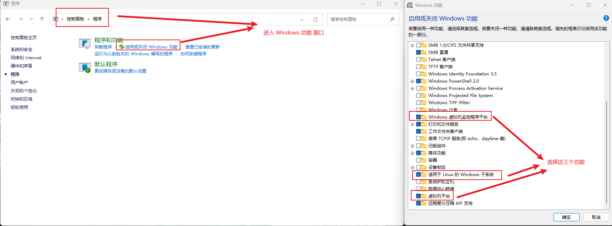
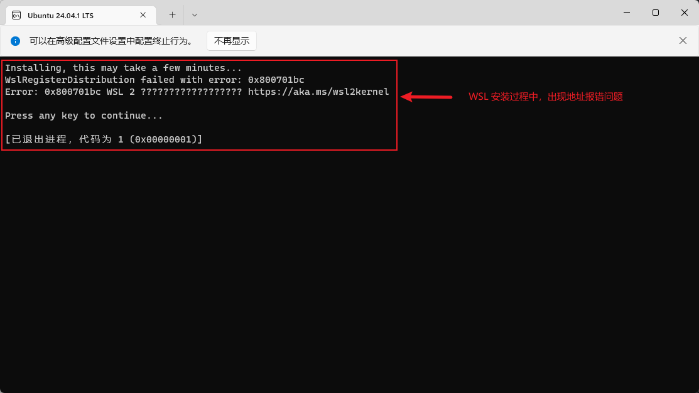
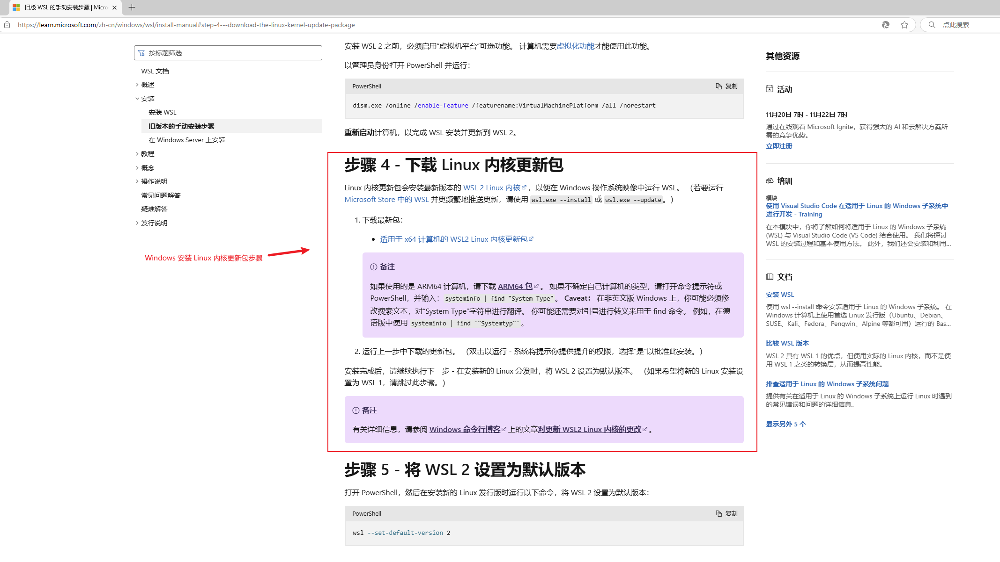

# WSL 安装笔记


## (1) WSL 安装过程
- [官方安装过程](https://learn.microsoft.com/zh-cn/windows/wsl/install-manual)
- 过程笔记
  - 控制面板启用下列功能后，才能使用 WSL 指令安装 Linux 虚拟机 
    - "Windows 虚拟机监控程序平台"
    - "适用于 Linux 的 Windows 子系统"
    - "虚拟机平台" 
- 使用 WSL 指令安装 Linux 虚拟机
```bash
# 将 WSL 2 设置为默认版本
PS C:\Users\33695> wsl --set-default-version 2
有关与 WSL 2 的主要区别的信息，请访问 https://aka.ms/wsl2
操作成功完成。

# 更新 WSL
PS C:\Users\33695\Desktop> wsl --update
正在安装: 适用于 Linux 的 Windows 子系统
已安装 适用于 Linux 的 Windows 子系统。

# 查看可下载的 Linux 发行版
PS C:\Users\33695\Desktop> wsl --list --online
以下是可安装的有效分发的列表。
请使用“wsl --install -d <分发>”安装。
NAME                            FRIENDLY NAME
Ubuntu                          Ubuntu
Debian                          Debian GNU/Linux
kali-linux                      Kali Linux Rolling
Ubuntu-18.04                    Ubuntu 18.04 LTS
Ubuntu-20.04                    Ubuntu 20.04 LTS
Ubuntu-22.04                    Ubuntu 22.04 LTS
Ubuntu-24.04                    Ubuntu 24.04 LTS
OracleLinux_7_9                 Oracle Linux 7.9
OracleLinux_8_7                 Oracle Linux 8.7
OracleLinux_9_1                 Oracle Linux 9.1
openSUSE-Leap-15.6              openSUSE Leap 15.6
SUSE-Linux-Enterprise-15-SP5    SUSE Linux Enterprise 15 SP5
SUSE-Linux-Enterprise-15-SP6    SUSE Linux Enterprise 15 SP6
openSUSE-Tumbleweed             openSUSE Tumbleweed

# 下载指定的 Linux 发行版
wsl --install -d Ubuntu-24.04

# 查看当前安装的所有 Linux 发行版
PS C:\Users\33695> wsl --list --verbose
  NAME            STATE           VERSION
* Ubuntu-24.04    Stopped         2

# 卸载指定的 Linux 发行版
PS C:\Users\33695> wsl --unregister Ubuntu-24.04
正在注销...

# 查看指定的 Linux 发行版是否卸载成功
PS C:\Users\33695> wsl --list --verbose
适用于 Linux 的 Windows 子系统没有已安装的分发版。
可以通过访问 Microsoft Store 来安装分发版:
https://aka.ms/wslstoref
```


## (2) WSL 安装遇到的 BUG


### (2.1) WslRegisterDistribution failed with error: 0x800701bc
- 报错截图: 
- 报错原因: Windows 没有安装 Linux 内核更新包
- 解决方案: Windows 安装 Linux 内核更新包 


## (3) WSL 换源 (Ubuntu)


### (3.1) 软件包换源
- [清华源官方教程](https://mirrors.tuna.tsinghua.edu.cn/help/ubuntu/)
- 更新软件包指令
```bash
# 更新软件包索引
katashi@natsume:~$ sudo apt-get update

# 更新软件包列表
katashi@natsume:~$ sudo apt update

# 升级所有软件包
katashi@natsume:~$ sudo apt upgrade

# 升级所有软件包，并自动移除不需要的软件包
katashi@natsume:~$ sudo apt full-upgrade

# 清理不再需要的软件包
katashi@natsume:~$ sudo apt autoremove

# 清理本地存储不再需要的包文件
katashi@natsume:~$ sudo apt clean
```

### (3.2) Docker
- [清华源官方教程](https://mirrors.tuna.tsinghua.edu.cn/help/docker-ce/)
