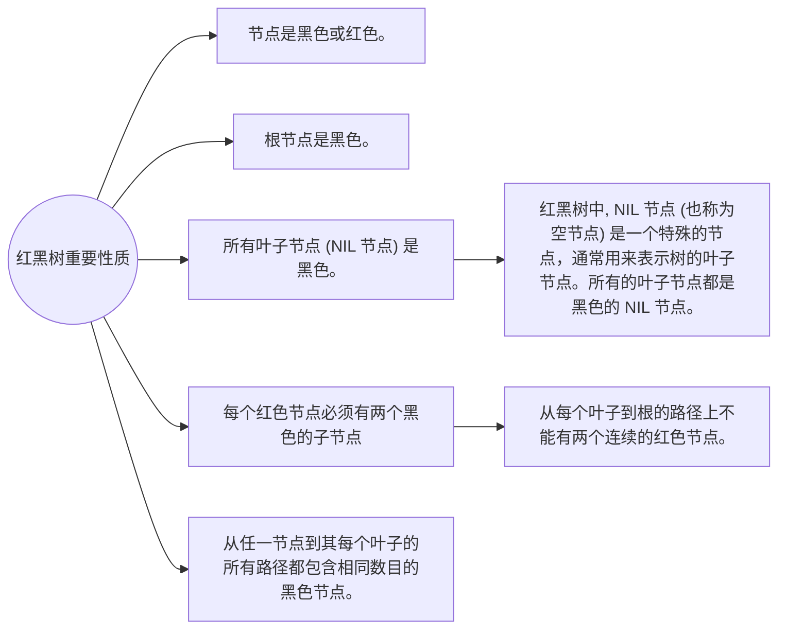

# 红黑树

&ensp;红黑树是一种自平衡二叉查找树。其重要性质如下所示：

```mermaid
    graph LR;
    id0((红黑树重要性质))-->A["节点是黑色或红色。"];
    id0-->B["根节点是黑色。"];
    id0-->C["所有叶子节点 (NIL 节点) 是黑色。"]-->C1["红黑树中, NIL 节点 (也称为空节点) 是一个特殊的节点，通常用来表示树的叶子节点。所有的叶子节点都是黑色的 NIL 节点。"];
    id0-->D["每个红色节点必须有两个黑色的子节点"]-->D1["从每个叶子到根的路径上不能有两个连续的红色节点。"];
    id0-->E["从任一节点到其每个叶子的所有路径都包含相同数目的黑色节点。"]
```

&ensp;上述性质确保了红黑树的平衡性，使其在最坏情况下的查找、插入、删除操作的时间复杂度均在$` O(logN) `$。